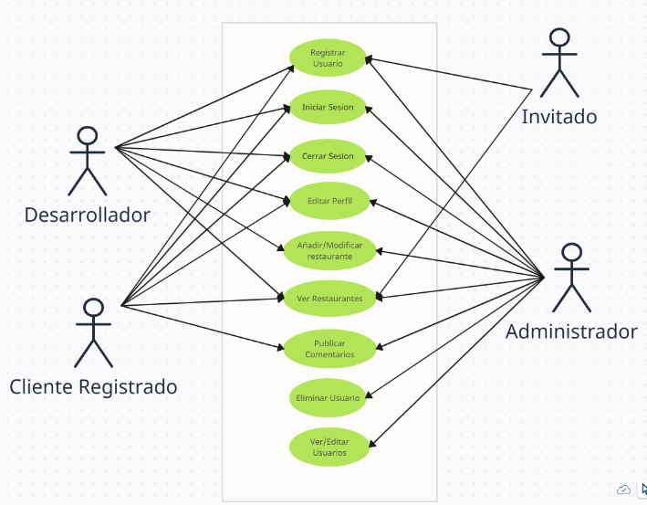
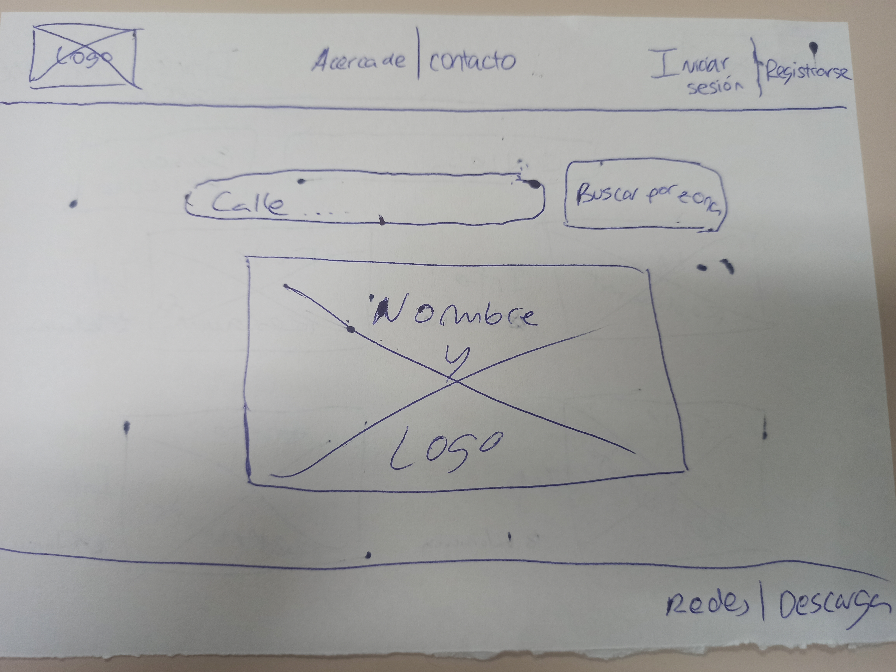
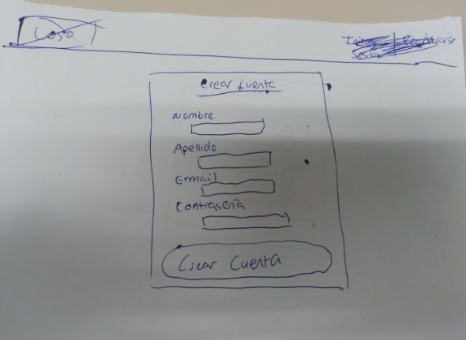
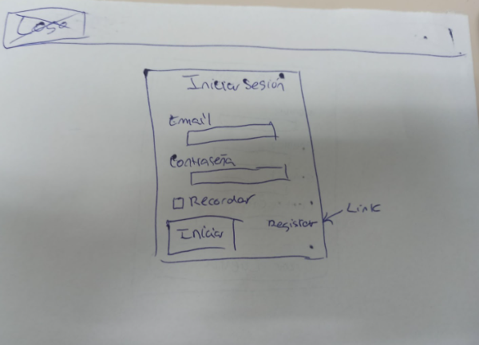
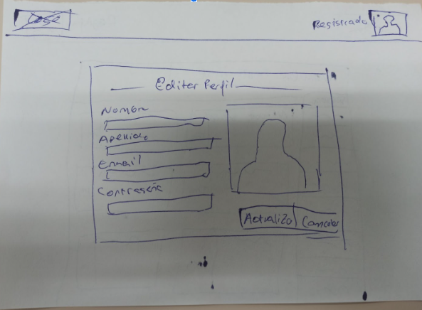
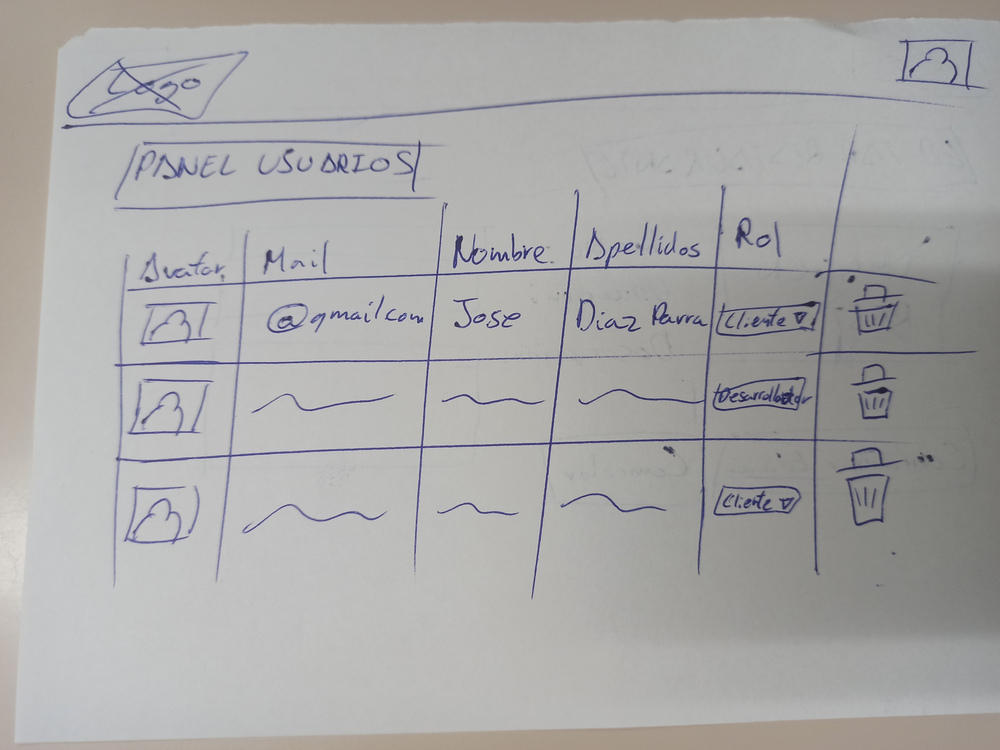

# Aplicación de servicio y reparto a domicilio

## Definición del proyecto y requisitos básicos

Nuestra aplicación será un página web dedicada al servicio de comida a domicilio, con un apartado de reseñas y valoraciones de los usuarios registrados, en la cual habrá diferentes roles de usuarios que puedan acceder a ella:

- Administrador: tendrá control total sobre la aplicación, en cuanto al código de la aplicación.

- Cliente registrado: podrá comprar los productos que él quiera, añadir productos a la cesta, con las compras que haga se le guardará unos descuentos, añadir restaurante o tiendas a favoritos y ver el seguimiento de su pedido.

- Desarrollador de contenido: Podrá crear el restaurante, añadirá, editará productos y eliminar.

- Invitado: sólo los restaurantes y tiendas, ver las reseñas de los restaurantes/tiendas, pero no podría comprar ni comentar.

## Casos de uso para la V1.0 - Definición básica​
- Registrar usuario: Un usuario puede registrarse en la plataforma proporcionando su nombre, apellidos, email y contraseña.
- Iniciar sesión: Un usuario registrado puede iniciar sesión en la plataforma proporcionando su email y contraseña.
- Cerrar sesión: Un usuario puede cerrar su sesión en la plataforma en cualquier momento.
- Editar perfil: Un usuario registrado puede editar su perfil, actualizando su nombre, apellidos, email o contraseña.
Registro de 1 solo restaurante.
- Ver Productos/Restaurantes: Un usuario registrado puede ver un listado de los restaurantes que hay disponibles y sus respectivos productos y puede comprarlo. El usuario invitado solo podrá ver los respectivos restaurantes y sus productos.
- Publicar comentario: Un usuario con el perfil de registrado puede publicar una reseña de cómo ha ido la compra y decir su opinión sobre el servicio
- Ver/Editar usuarios: Un administrador puede ver una tabla con todos los usuarios que hay registrados y editar la información, incluido el ROL de usuario.
- Eliminar usuario: Un administrador puede eliminar cualquier usuario registrado en la plataforma

## Diseño de Bocetos
### Home y menús usuarios

Hemos didivido la interficie en 3 zonas, el encabezado (header), el cuerpo principal (main) y el pie de página (footer).

* En el header vamos a alojar una barra superior fija con: el logo y nombre de la web (que hará las veces de link a la página principal), un menú central genérico (para acceder a páginas públicas), un menú central específico (que será diferente en función del rol de usuario logueado), y un icono (avatar) que permitirá ver la imagen del usuario logueado y que hará de botón para desplegar otro menú, el menú de usuario (que tendrá diferentes items dependiendo de si la sesió está abierta o no y del tipo de rol que tenga el usuario logueado).
* El cuerpo (main) albergará el contenido de las páginas. Será la sección que vaya cambiando dependiendo de la página que carguemos. En la página home simplemente aparece una imagen de fondo y el nombre de la web.
* El header será meramente informativo.

### Regitro de un usuario

### Iniciar Sesión

### Editar mi Perfil

Editar perfil será una ventana modal, es decir, se mostrará la ventana y el fondo se volverá oscuro.

Esta ventana de edición permitirá, además de modificar los datos del usuario, añadir una imagen de avatar. Por el momento, en esta primera versión, podremos añadir el link de una imagen que esté alojada en un servidor. En la siguiente versión (versión 1.1) actualizaremos esta ventana para que puedan subirse archivos (imágenes) al servidor.

### Listado de todos los proyectos

En esta página podemos ver, en la pestaña izquierda, todos los proyectos en forma de tabla. La pestaña derecha mostrará solo los proyectos que ha subido el usuario que ha iniciado la sesión.

Al hacer clic en cualquier parte de la fila se accede al detalle del proyecto.

También tenemos un buscador que permite buscar proyectos por palabras clave en el nombre o descripción.

Las celdas de encabezado de las tablas incluyen un icono (flecha hacia arriba o hacia abajo) que permitirá ordenar la tabla por la columna en concreto.

### Listado de Mis proyectos

En esta pestaña podemos ver los trabajos pertenecientes al usuario logueado. En cada fila aparece, además, un icono para editar y borrar el proyecto correspondiente. Por otro lado tenemos la opción de subir un nuevo proyecto.

Habría que valorar si es mejor crear un único buscador para el nombre y descripción del proyecto o dos barras de busqueda, una para cada sección, tal y como se muestra en el boceto anterior.

### Detalle de un proyecto

Si el usuario que está viendo la información de un proyecto en concreto es el autor de dicho proyecto, aparecerá un icono para la edición del mismo.

### Nuevo proyecto / Editar un proyecto

Esta vista sirve tanto para crear un nuevo proyecto como para editarlo.

Si el proyecto es nuevo, el botón mostrará el texto ENVIAR, pero si estamos editándolo aparecerá el texto ACTUALIZAR. Al crear o actualizar el proyecto, la web nos reenvía a la vista 'Detalle de proyecto'.

### Panel administración de proyectos

Si tienes el rol 'administrador' aparecerá el item 'Panel administración' en el menú superior específico. Este item nos permite cargar la vista 'Panel administración de proyectos'. Desde esta vista también podemos acceder al 'Panel administración de usuarios'.

Esta vista permite editar o borrar cualquier proyecto haciendo click en los iconos correspondientes. La opción editar nos llevará a la vista 'Editar proyecto'

### Panel administración de usuarios

Esta vista permite editar los datos de los usuarios. Por supuesto es solo accesible para los administradores.
